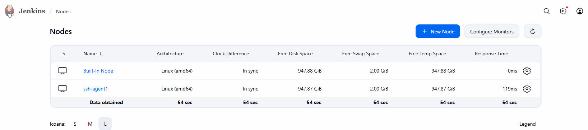
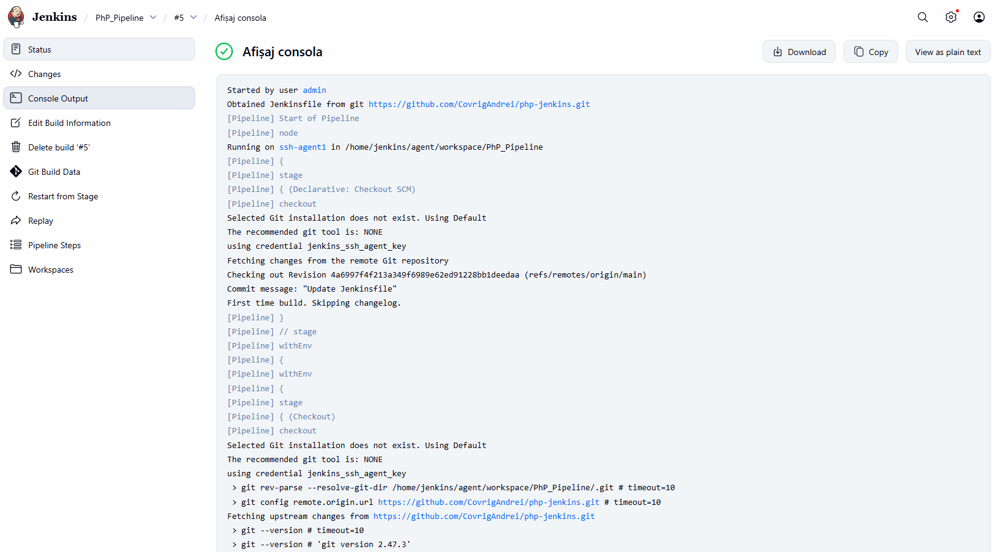

# Lucrare de laborator Nr.3: Task Scheduler (cron) Configuration
# Covrig Andrei, grupa I2301
# 2025

## Scopul lucrării
Configurarea **Jenkins** pentru automatizarea sarcinilor DevOps, inclusiv pentru crearea și gestionarea pipeline-urilor CI/CD (Continuous Integration / Continuous Deployment)

## Etapele realizării lucrării
### Pregătire

Am creat un folder numit `lab04` în repository-ul meu GitHub, unde am salvat toate fișierele necesare pentru această lucrare de laborator.

De asemenea, am verificat că aveam instalate Docker și Docker Compose.
### Crearea fișierului `docker-compose.yml`

Am creat fișierul `docker-compose.yml` și am definit în el serviciile necesare: **Jenkins Controller** și **SSH Agent**.

### Configurarea și pornirea Jenkins Controller

Am adăugat următoarea configurație în fișierul `docker-compose.yml`:
```yaml
services:
  jenkins-controller:
    image: jenkins/jenkins:lts
    container_name: jenkins-controller
    ports:
      - "8080:8080"
      - "50000:50000"
    volumes:
      - jenkins_home:/var/jenkins_home
    networks:
      - jenkins-network

volumes:
  jenkins_home:
  jenkins_agent_volume:

networks:
  jenkins-network:
    driver: bridge
```
Am folosit imaginea oficială `jenkins/jenkins:lts`, am mapat porturile `8080` și `50000`, și am definit un volum pentru a păstra datele Jenkins.

Am pornit containerul Jenkins folosind comanda:

```bash
docker-compose up -d
```
Apoi am accesat interfața Jenkins la adresa `http://localhost:8080`.

Am obținut parola de deblocare rulând:

```bash
docker logs jenkins-controller
```
și am urmat instrucțiunile de configurare inițială din browser.

### Configurarea SSH Agent

Am creat un folder `secrets` în rădăcina proiectului pentru cheile SSH, rulând comenzile:

```bash
mkdir secrets
cd secrets
ssh-keygen -f jenkins_agent_ssh_key
```

În rădăcina proiectului, am creat fișierul Dockerfile cu următorul conținut:

```dockerfile
FROM jenkins/ssh-agent

# Instalează PHP-CLI
RUN apt-get update && apt-get install -y php-cli
```
Am folosit imaginea de bază `jenkins/ssh-agent` și am instalat PHP-CLI, necesar pentru rularea testelor PHP.

Am completat `docker-compose.yml` cu următoarea secțiune:
```yaml
  ssh-agent:
    build:
      context: .
      dockerfile: Dockerfile
    container_name: ssh-agent
    environment:
      - JENKINS_AGENT_SSH_PUBKEY=${JENKINS_AGENT_SSH_PUBKEY}
    volumes:
      - jenkins_agent_volume:/home/jenkins/agent
    depends_on:
      - jenkins-controller
    networks:
      - jenkins-network
```

Astfel, agentul SSH s-a construit local din Dockerfile, folosind cheia publică stocată în variabila de mediu.

Am creat fișierul `.env` în rădăcina proiectului și am adăugat următoarea linie:

```ini
JENKINS_AGENT_SSH_PUBKEY=conținutul_cheii_publice
```

Am repornit serviciile pentru a aplica modificările, rulând comenzile:

```bash
docker-compose down
docker-compose up -d --build
```

### Conectarea SSH Agent la Jenkins

Am verificat că pluginul **SSH Agents Plugin era instalat**. Deoarece nu exista, l-am instalat din: `Manage Jenkins → Manage Plugins → Available → SSH Agents Plugin`.

Apoi am înregistrat cheia SSH în Jenkins:

1. M-am autentificat în interfața web Jenkins la adresa `http://localhost:8080`.

2. Am accesat `Manage Jenkins > Manage Credentials`.

3. Am adăugat o nouă cheie SSH, am setat numele de utilizator ca `jenkins` și am selectat cheia privată corespunzătoare din folderul `secrets`.

După aceasta, am adăugat un nou nod (agent Jenkins):

1. Am mers la `Manage Jenkins > Manage Nodes and Clouds > New Node`.

2. Am denumit nodul `ssh-agent1` și am selectat tipul `Permanent Agent`.

3. Am adăugat eticheta `php-agent` pentru nod. 

4. Am configurat nodul specificând:

    - Directorul root la distanță: `/home/jenkins/agent`

    - Metoda de lansare: `Launch agents via SSH`

    - Host: `ssh-agent`

    - Credențiale: am selectat cheia SSH adăugată anterior



### Crearea unui pipeline Jenkins pentru automatizarea sarcinilor DevOps și rularea acestuia

Am folosit un repository GitHub cu un proiect PHP ce conținea teste unitare.
Am creat un fișier `Jenkinsfile` în acel proiect:

```groovy
pipeline {
    // Agentul pe care va rula pipeline-ul
    agent {
        label 'php-agent'
    }
    
    // Variabile de mediu
    environment {
        PROJECT_NAME = 'php-jenkins'
    }
    
    // Etapele pipeline-ului
    stages {
        // Stage 1: Checkout - preluarea codului din repository
        stage('Checkout') {
            steps {
                checkout scm  
                echo 'Codul a fost extras cu succes'
            }
        }
        
        // Stage 2: Verificarea mediului de execuție
        stage('Verify Environment') {
            steps {
                echo '🔧 Verificarea mediului de execuție...'
                sh '''
                    # Afișează directorul curent de lucru
                    echo "Working directory: $(pwd)"
                    
                    # Afișează versiunea de PHP instalată
                    echo "PHP version: $(php --version | head -1)"
                    
                    # Afișează structura proiectului - toate fișierele PHP
                    echo "Project structure:"
                    find . -type f -name "*.php" | sort
                '''
            }
        }
        
        // Stage 3: Rularea testelor unitare
        stage('Run Unit Tests') {
            steps {
                echo 'Rularea testelor unitare...'
                sh '''
                    # Verifică sintaxa tuturor fișierelor PHP
                    echo "Running basic syntax check..."
                    find src tests -name "*.php" -exec php -l {} \\;
                    
                    # Rulează testele pentru clasa Calculator
                    echo "Running Calculator tests..."
                    php tests/CalculatorTest.php
                    
                    # Rulează testele pentru clasa StringUtils
                    echo "Running StringUtils tests..."
                    php tests/StringUtilsTest.php
                '''
            }
        }
        
        // Stage 4: Analiza codului și metrici
        stage('Code Analysis') {
            steps {
                echo 'Analizarea codului...'
                sh '''
                    # Numără liniile de cod din directorul src/
                    echo "Lines of PHP code:"
                    find src -name "*.php" -exec wc -l {} + | tail -1
                    
                    # Numără liniile de cod din teste
                    echo "Lines of test code:"
                    find tests -name "*.php" -exec wc -l {} + | tail -1
                    
                    # Afișează statistici generale despre cod
                    echo "Code structure:"
                    echo "PHP Files: $(find . -name '*.php' | wc -l)"
                    echo "Total Lines: $(find . -name '*.php' -exec cat {} + | wc -l)"
                '''
            }
        }
    }
    
    // Acțiuni post-build 
    post {
        // Rulează întotdeauna, indiferent de starea pipeline-ului
        always {
            echo "Pipeline finalizat pentru ${PROJECT_NAME}"
        }
        
        // Rulează doar dacă toate stage-urile au avut succes
        success {
            echo 'SUCCES: Toate testele au trecut!'
        }
        
        // Rulează dacă orice stage a eșuat
        failure {
            echo 'EROARE: Unele teste au eșuat!'
        }
    }
}
```

În continuare, am creat un pipeline nou în Jenkins: am intrat în dashboard, am apăsat pe **New Item**, am scris numele pipeline-ului, am selectat tipul **Pipeline** și am dat **OK**. Apoi am configurat pipeline-ul să ia codul direct din repository-ul meu de pe GitHub: am selectat **Pipeline script from SCM**, am ales Git, am introdus URL-ul complet al repository-ului `https://github.com/CovrigAndrei/php-jenkins/tree/main`, am selectat credentialele SSH pentru GitHub, am pus branch-ul **main** și am specificat calea către fișier ca fiind **Jenkinsfile**. Am salvat configurația și imediat am apăsat **Build Now**. Pipeline-ul a început să ruleze și, pentru că totul era configurat corect, toate testele au trecut și build-ul s-a terminat cu succes.




### Crearea raportului

Am creat în directorul `lab04` fișierul `readme.md` care conține descrierea pas cu pas a executării proiectului.

## Răspunsuri la întrebări:

1. Avantajele utilizării Jenkins pentru automatizarea sarcinilor DevOps?

Jenkins este esențial în DevOps, oferind automatizare completă pentru întregul ciclu CI/CD, de la construire la implementare. Beneficiul major este reducerea semnificativă a erorilor umane prin automatizarea testării și a implementării, ceea ce duce la o creștere a calității și la o livrare mult mai rapidă a software-ului . Flexibilitatea sa se datorează ecosistemului vast de plugin-uri, care permit integrarea cu orice tehnologie. În esență, Jenkins transformă procesele manuale în fluxuri de lucru automatizate, sporind colaborarea și eficiența generală a echipei.

2. Ce alte tipuri de agenți Jenkins există?

Agenții Jenkins, cunoscuți ca noduri de execuție, se împart în două mari categorii pentru a gestiona eficient sarcinile. Prima categorie este reprezentată de Agenții Permanenți, mașini fizice sau virtuale care sunt configurate să fie mereu disponibile, folosind metode de conectare precum SSH, și sunt potriviți pentru sarcini care necesită un mediu de execuție constant și stabil. A doua categorie este cea a Agenților Dinamici, care sunt creați rapid, la cerere, prin integrarea cu tehnologii de cloud sau containerizare, cum ar fi Docker și Kubernetes . Acești agenți dinamici oferă o scalabilitate automată, permițând echipei să răspundă eficient la fluctuațiile de încărcare și să optimizeze costurile prin distrugerea lor după finalizarea job-ului.

3. Ce probleme am întâmpinat când am configurat Jenkins și cum le-am rezolvat?

Una dintre problemele principale a fost conectarea prin SSH între controller și agent. Jenkins nu reușea să se conecteze, așa că am verificat cheile SSH. În plus, unele pluginuri nu erau compatibile, așa că le-am actualizat și am verificat dependențele în Plugin Manager.

## Concluzii

În cadrul acestei lucrări de laborator, am implementat cu succes o infrastructură CI/CD utilizând Jenkins împreună cu Docker și Docker Compose. Am configurat un mediu de execuție format dintr-un `jenkins-controller` și un `ssh-agent`, asigurând o conexiune securizată prin protocolul SSH.

Pipeline-ul descris în Jenkinsfile a permis automatizarea completă a procesului DevOps, acoperind etapele de preluare a codului sursă, rulare a testelor unitare și efectuare a analizei codului.

Finalizarea cu succes a procesului de build a demonstrat importanța Jenkins ca element central în orchestrarea livrării rapide și fiabile a aplicațiilor software.

## Bibliografie

1. [Pipeline as Code, Jenkins](https://www.jenkins.io/doc/book/pipeline/pipeline-as-code)
2. [edeshina, Jenkins Scripted Pipeline: How to Use, Habr, 2023-01-10](https://habr.com/ru/companies/slurm/articles/709804)
3. [Pipeline as Code with Jenkins, Jenkins](https://www.jenkins.io/solutions/pipeline)